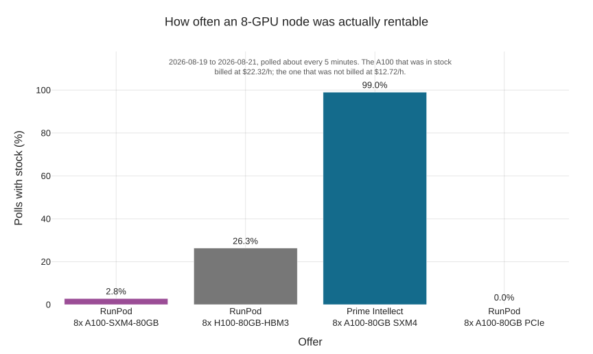

# GPU clusters are cheap, but unavailable.. what now?

You're got a great idea on a new model to train or finetune. You've been trying to use a single GPU for as long as possible, to avoid having to deal with all the difficulties of distributed training, but given the data and model sizes it is not possible to continue doing that. So you look around and realize that renting a decent multi-gpu rig is not even that expensive, with a plethora of providers, and marketplaces pooling providers, offering 8 GPUs from the previous generation (A100) for as low as $16 an hour. That's certainly affordable even for learning or play purposes, so you decide to go ahead and rent one.. except that as soon as you actually try to reserve it, you realize there is practically no stock left. Renting a single GPU os any calibre is easy, renting an 8-GPU pod with fast interconnect takes a lot of patience and luck (watcher scripts), and getting a cluster with more than one pods is near impossible. No wonder, given the articles stating that both rent and build capacity is sold out until the end of 2027 at many data centers. 

Any distributed training guide will start by telling how much the whole process is communications-bound, so the question is, what can you do with the left-over capacity that one can scrape? Is a pod with a slower interconnect a waste of money? How much performance can we expect using the most common distributed algorithms with what one can find on the marker right now? As a guiding task, I have picked the nanogtp speedrunning benchmark, which is large enough to benefit from multiple GPUs, small enough to finish in a reasonable time, and widely tested and studied. Part I focuses on data parallelism one a single pod, while Part II will focus on other parallel techniques and multi-pod clusters.

# Setup and baseline

Karpathy started the now-famous nanogpt challenge, which is about training a small GPT2-like model to a given validation value as fast as possible on a fixed hardware. This led to a community speedrunning competition, in which a series of patches took the original training time from 45 minutes on 8xH100 (90 minutes on 8xA100) down to 1.23 minutes. This is a perfect starting point for our distributed training measurements - the model and data is small enough that I could run tests on my desktop and that cloud measurements don't cost too much, large enough to benefit from multiple GPUs and have a meaningful measurable time, and known enough so that anyone can easily understand what is being measured. In order to keep the model and the code simple and easy to understand, I did not use the fastest entry from the speedrunning leaderboard, as some of the optimizations seemed rather low-level, specific to this model, or I simply had no idea what they were doing. Instead, I chose to start from the original GPT2 baseline and apply some of the most widely understood and tested optimziations from the first entries of the leaderboard, such as using rotary embeddings, using ReLU^2, zero-initializing projections, applying QK-norm and untying embedding and head. However, I decided to skip the Muon optimizer for now. While Muon was integral to the nanogpt-speedrunning competition, it is less widely used and I wanted to keep the most well-known optimizer. 

This way, my baseline ended up being ~7h/$14 on an A100 and ~21h/$4 minutes on a 3090 card in my desktop. This latter cost is misleading, as it only includes raw electricity but not capital costs (i.e. what I paid for the card). Spending an extra $11 allows a baseline run in one third of a time, without the noise and heat in my room.

In order to make measurements across different world sizes consistent, it is important that the data loader is deterministic and yields batches in a fixed order regardless of the number of ranks. Most measurements were done on A100 machines, as opposed to the latest H100, as it had slightly better availability and yielded a little lower total cost.

# Ideal setup: DDP over high-speed interconnect

The ideal setup for training on multiple GPUs is an 8-GPU pod with high-speed NVLink interconnect between the cards. The simplest approach of using multiple cards in parallel is data parallelism, in which case each GPU has an identical copy of the model, calculates gradients independently for a different set of the data, then shares the gradients between all GPUs and calculates model updates using the same macrobatch gradient. As we can see from this very short description, this requires a communication step the size of the model before each model update (in each macrobatch), which shows why a fast interconnect is important. 

Schematics of data parallelism (in a naive implementation). Image taken from the [Ultrascale Playbook](https://huggingface.co/spaces/nanotron/ultrascale-playbook?section=data_parallelism).

Using the ideal setup of 8xA100 GPUs with NVLink interconnect, the model can be trained in less than hour, resulting in an almost-linear speedup. What's even better is that it costs almost exactly the same, which makes using DDP a no-brainer in this case.

A naive implementation of DDP would introduce a long bottleneck after the local computation has finished on each rank, and before the gradients are received from all other ranks, which is the biggest no-no in distributed computing, leading to low GPU utilization and inflated costs. DDP actually has a couple of tricks to reduce this gap, which are explained in detail (with measurements) in Appendix 1. 

# DDP over slower interconnect

8xA100 over NVLink is the ideal setup.. if you can get it. Turns out, despite showcasing per-GPU prices on their homepage, most providers barely have any capacity of proper 8-GPU clusters available. In a brief period of 2 days, RunPod only had 8-GPU capacity <3% of the time, while PrimeIntellect, which is itself a marketplace collecting offers from multiple providers, only had it at almost twice the usual price.

Image: picture of 'unavailable' texts from RunPod, PrimeIntellect, etc.

If capacity becomes available, it is sometimes using the slower PCIe interconnect between cards, or maybe even the required number of GPUs spread in multiple pods. Should you rent this anyway, or does the slow communication destroy all benefits of having multiple cards and you would be just wasting money? This of course heavily depends on the specific use case you're working with (especially the size of the model and how long processing a single batch takes on the given GPU), so this only gives an indication for this particular problem (very small model). In order to better understand this, I ran the same workload with DDP on 8xA100 cards, with increasingly slow interconnects between the cards. The fastest is still a full NVLink, while the second most common option would be communication through the host's PCIe lanes. Next I included a setup where communication was forced to go through the local TCP interface, so it included the hosts' network stack as well, but did not actually leave the NIC. I also added two simulated cases, where the network connection speed was artificially limited to 40Gbit/s and 10GBit/s respectively, to simulate the effect of renting A100s in different boxes, connected using traditional network connections.

Whether renting machines with slower interconnects makes sense depends on your priorities. As we saw previously, a pod with a high-speed interconnect is a no-brainer, as it reduces runtime by almost 8 times for virtually free. A pod with any form of within-host communication still trains two to three times faster than a single GPU, but also costs two to three times as much. Essentially, you're paying a high premium for a somewhat faster run. However, if your bandwidth is limited to even 40Gbits/s, which is nothing to sniff at in terms o f network bandwidth, then using multiple GPUs with data distributed training hardly make sense. The whole training can become much slower than on a single GPU, and it will also cost a lot more. 

What happens in these cases is that the GPUs spend most of their time waiting for communication to happen, so you're paying mostly for wasted hours.

Plotting the total time to a converged run shows us that it is almost completely linear in the available communication bandwidth. This is hardly surprising, given that a compute batch with a batch size of 64 is around 43ms, and the communication overheard goes from ~7ms on NVLink to over 1000ms over TCP.

# Lowering the communication need with DiLoCo

A reduction in the available communication bandwidth led to a clear underutilization of GPUs. We can't create well-connected GPU pods out of nowhere, so can we do something about the distributed algorithm to reduce the dependence on frequent high-bandwidth communication? When using DDP, the most important knob we have is increasing the batch size, but that becomes undesirable quickly. As we keep increasing the batch size, more and more samples are processed before any update happens to the model. This means we already have a lot of information that tells us what to change in the model (the gradient accumulated so far), yet we keep processing more minibatches with the original model just to be extra certain. It is easy to see how this becomes a waste of computation above a certain size. (Of course DDP also has other parameters we could tune, such as the bucket size, overlap window, or compression, to name a few.)

An alternative approach is to let the ranks perform updates to their models individually, without having to communicate with other ranks, and only perform some form of synchronization less frquently. There is a multitude of ways of achieving this, the question is how well we can combine these individual changes - do they compound or do they diverge? Distributed Low-communication (DiLoCo) is a method for achieving this, which was shown to work reasonably well. Under DiLoCo, each rank uses the original optimizer to calculate small model updates, which are then shared between ranks less often, and an outer optimizer calculates the global update to the model, which is then shared to each rank. A very nice additional advantage of DiLoCo is that it makes much easier to use a heterogenous set of GPUs, which may require different microbatch sizes and finish computation at different times. The original paper suggests that this can be used to decrease the communication overhead by 500 times, which is certainly a very appealing prospect. Can we use this to overcome our GPU poorness?

DiLoCo architecture. Image from the [DiLoCo paper](https://arxiv.org/abs/2311.08105).

As we can see, under the same 10k steps training regime, DiLoCo has worsened the validation result by 0.245 points in the end (3.525 instead of 3.28 validation loss). While I didn't run experiments to find the exact step count at which DiLoCo achieves the desired 3.28 validation loss, looking at the trend it looks like that it tracks the original validation loss curve by taking roughly three times as many steps. Luckily it barely adds any overhead compared to a non-distributed training in terms of training time or total cost (for the same step count with worse results), so what we can conclude from this is that it allows training a model that is consistently above by 0.25 val loss at the same steps, or that it trains a model to the same quality at 3x the price. (All numbers in the text are quoted for the K=8 case. The difference is much smaller when only using 2 workers.)

We must not forget however that DiLoCo introduced three new parameters to tune: the outer step size H, outer learning rate and moment. Originally I planned to use the hyperparameters reported in the publication, but those quickly turned out to be unsuitable for this model. We could say that in order to tune this properly, now we need to spend additional money on figuring out reasonable values for these parameters, on top of all the other parameters you use for your problem, which means additional cost and uncertainty. The hyperparameters used in my study are simple guesses, so I am certain one could reduce the difference with a bit of hyperparameter tuning.

While I did not run enough experiments to find the actual crossing point for DiLoCo, assuming a 3x step count from the original training holds, we can still count how much it would cost to train our model to the desired level with sub-optimal network connections. We find that DiLoCo has the great advantage of being virtually unaffected by the reduction in communication speed, and remaining usable over slow network links with high MFU. 

If you are forced to accept suboptimal pods, or GPUs over multiple pods with a regular network connection between them, DiLoCo appears to move the economic crossover far enough that poorly connected GPUs may become viable, but establishing the true cost requires tuning and a measured run to the target loss.

# Conclusion
...

# What's missing 

- Each run was repeated only once, so no spread/uncertainty is shown on any of the plots or numbers
- While I deliberately excluded the Muon optimizer from the model, there are still some optimizations using Adamw tested in the modded-nanogpt repo that I haven't adopted and which left another 50% of performance in the model. While this wouldn't have made the distributed results any different, it would have made the experiments faster/cheaper/allowed me to try more hyperparameters
- Hyperparameter search for DiLoCo was not performed, so the related conclusions are weaker then they could be

# Appendix
## A0. How fast are those GPUs, really?
In order to calculate Model Flops Utilization (MFU), the most widely used metric when measuring distributed algorithms, we first need to know the actual maximum flops for the given GPU. The obvious move is to look it up in the datasheet, but that gave me a bit of a headache. A vendor spec sheet quotes several different numbers for what looks like the same thing: tensor core versus plain shader rates, dense versus 2:4-sparse figures (a factor of two), and for FP16/BF16 there are separate rates depending on whether the accumulation happens in FP16 or FP32 (another factor of two on consumer cards). My first attempt entered the RTX 3090 at 35.6 TFLOP/s, which is that card's FP32 *non-tensor* rate, and the training loop then cheerfully reported an MFU of 158%. The only reason I caught it is that anything above 100% is impossible.

So I stopped citing and started measuring: `scripts/measure_roofline.py` runs a large square bf16 GEMM at a few sizes and reports the best sustained throughput. That is a lower bound on the true peak rather than the peak itself, but it is what the hardware demonstrably does, which is the honest denominator for MFU. Every MFU number in this post is computed against a measured peak for that exact card, and the difference from the datasheet is not small:

| Card | Measured bf16 | Datasheet dense | Measured / datasheet |
|---|---|---|---|
| A100-SXM4-80GB | 269.9 | 312.0 | 86.5% |
| A100-SXM4-40GB | 270.1 | 312.0 | 86.6% |
| A100 80GB PCIe | 256.5 | 312.0 | 82.2% (71.8% at 16384³) |
| RTX 3090 | 82.6 | 71.2 | 116% |

The two A100 SXM4 cards land at ~86.5% of their quoted 312 TFLOP/s, which is roughly what you would expect from a real GEMM against a marketing number. The PCIe A100 is the interesting one: NVIDIA quotes the same 312 for it as for the SXM4 part, even though it is a 300 W card rather than a 400 W one, and it does not hold up. It peaks at 256.5 TFLOP/s on a 4096³ GEMM and then *falls* to 223.9 on a 16384³ one, i.e. it throttles on exactly the long, large matmuls that training consists of, where the SXM4 cards hold their rate. The 3090 goes the other way, and at first glance it looks impossible. The [GA102 whitepaper](https://www.nvidia.com/content/PDF/nvidia-ampere-ga-102-gpu-architecture-whitepaper-v2.1.pdf) gives 71.2 TFLOP/s for dense bf16 tensor with FP32 accumulate — the only bf16 mode the hardware has, since bf16 always accumulates in FP32, and the 142.3 printed beside it is that same rate with 2:4 sparsity — while my card sustains 82.6, 16% *above* the published rate. The resolution is the clock. Peak rates in that table are quoted at the 3090 Founders Edition's 1695 MHz boost, and my card is not a Founders Edition: it has a 420 W power limit, and sampled during a 16384³ bf16 GEMM it holds a mean SM clock of 1990 MHz at 394 W, power-capped rather than thermally throttled. Per clock that is 41.7 kFLOP against the 42.0 kFLOP/clk the whitepaper figure implies — 99.3% of the architectural rate. The card is doing exactly what NVIDIA says a GA102 does, at a 17% higher clock than the table assumes; a rented 3090 that measured 75.3 TFLOP/s is the same per-clock rate at about 1.79 GHz. A peak quoted at a reference boost clock is no more a property of the card in your machine than a peak quoted for a 400 W part describes the 300 W one you rented.

All this is really just to say that even the seemingly trivial question of 'what is the fastest this card can go that I'm comparing again' holds more than what one would expect, making it easy to derive incorrect conclusions from measurements across different providers, pods and GPUs.

## A1. What makes DDP go brr

Data parallelism works by dividing the batch into K distinc parts, each rank (GPU) processing a single part of this, then averaging using the `all_reduce` communication primitive to share the partial gradients between all ranks, and using this global gradient to perform identical updates on the model parameters on each rank. In order to better understand the trade-offs and gain a bit more familiarity, I've implemented them by hand, using just the basic communication primitives like `all_reduce` and `broadcast`. While describing each algorithm fully in detail is well out of scope for this post, you can find fantastic descriptions like the [Ultrascale Playbook](https://huggingface.co/spaces/nanotron/ultrascale-playbook).

Schematics of data parallelism (in a naive implementation). Image taken from the [Ultrascale Playbook](https://huggingface.co/spaces/nanotron/ultrascale-playbook?section=data_parallelism).

A naive implementation first waits to finish all gradient calculations, then initiates an `all_reduce` separately for each tensor. There are a few problems with this; first is that initiating the communication has some overhead in itself, so performing it one by one for small tensors is inefficient. A slightly improved version is `ddp_bucketed`, which combines tensors into buckets of predefined sizes, thus reducing the initiaited `all_reduce`s primitives, saving some of that overhead. This in itself isn't a huge win though, and we can do better. Gradients are calculated backwards, and don't depend on each other after they've been calculated, so we can immediately share them as soon as they become available. This way, we can overlap the communication of the last gradient with the computation of the preceding ones, and avoid the dreaded gaps in GPU utilization that is the result of blocking communication. 

Schematics of interleaved and bucketed data parallelism. Image taken from the [Ultrascale Playbook](https://huggingface.co/spaces/nanotron/ultrascale-playbook?section=data_parallelism).

There are a few low-level details we need top pay attention to though. First of all, as with all these communication primitives, we need to ensure that all ranks try to communicate the same tensors at the same time, as the low level primitives simply push data (tensor values) through the channel, without any additional metadata or checks for verifying these are actually matching tensors. Whilte this trivially holds for our small and simple model, we could theoretically end up in a situation where a rank calculates no gradient in a given batch for a given tensor, e.g. when using Mixture of Experts models. We also need to ensure the buckets we create are in the order the gradients become available, so we can't just blindly follow the definition of model parts. Things like tying the embedding and lm head (the first and last tensors in the graph) can easily trick us. However, the largest effect we have is actually the compiler. One of the most important optimizations the compiler performs is fusing together succeeding operations, so they are performed as a single large kernel on the GPU, without any interruption and host communication. This makes the computation faster, but it also removes the hooks we are using for triggering early communication while the rest of the computation still goes on. Theoretically we could force graph breaks between our buckets, which act as barriers, telling the compiler to treat the tensors belonging to each bucket as separate items, which is actually what PyTorch did in previous versions. However, this trades computation speed for the hopeful speedup from overlapping communication. Newer PyTorch versions have a smarter way of handling this, where knowledge about DDP is part of the compiler optimization process. (FIXME: how does that actually work?)

Above is a plot of how much slower is each version of DDP compared to the fastest. On the left, we can see that while using NVLink, the difference is negligible, virtually all methods perform identically. On a slower interconnect, shown on the right, the difference become more pronounced. However, we can also see that the actual method only makes a difference if there is enough computation happening under which communication can be hidden. As the microbatch increases (x axis to the right), so does the time it takes to process the batch. At the microbatch size of 8, the total computation takes only 49.5ms against a 649 MB all-reduce that takes over a second. The collective is 96% of the step and every mode issues the same one, so the entire implementation question lives in the remaining 4%. Naive is the exception because it changes the communication itself - 75 small collectives instead of 14 fused ones, which costs ~400 ms - while the other three sit within one compute-time of each other and their ranking is decided by host jitter. This leads to the conclusion that it is best to maximize the microbatch size, but that is something you'd be doing anyway. The general more lesson is the same we have also seen previously, meaning that what matters is the ratio of compute to communication, and every "X is faster than Y" claim about distributed training is really a claim about where you sit
on that axis.

## What would make DiLoCo go brr

DiLoCo in the current tests is completely untuned. However, the end of the training looks particularly suspicious and worth a bit of extra discussion. The training currently uses a trapezoidal LR schedule, so there is a warmdown period in the end, as per one of the entries in modded-nanogpt. This is only applied to the original optimizer, not the outer optimizer utilized by DiLoCo. The outer optimizer uses Nesterov momentum, so it keeps making fairly large steps influenced by the previous gradient directions even when the incoming gradients keep getting smaller. Most likely attenuating the momentum to zero would significantly reduce the overshoot here, and help the DiLoCo version keep close to the validation loss of the baseline, without the weird divergence in the last 1k steps.
