# GPU clusters are cheap, but unavailable... what now?

You've got a great idea for a new model to train or fine-tune. You've been trying to use a single GPU for as long as possible to avoid dealing with all the difficulties of distributed training, but given the data and model sizes, it is not possible to continue doing that. So you look around and realize that renting a decent multi-GPU rig is not even that expensive, with a plethora of providers and marketplaces pooling their offers and advertising eight previous-generation GPUs (A100s) for as little as $16 an hour. That's certainly affordable even for learning or play purposes, so you decide to go ahead and rent one... except that as soon as you actually try to reserve it, you realize there is practically no stock left. Renting a single GPU of almost any caliber is easy; renting an 8-GPU pod with a fast interconnect takes a lot of patience and luck (or watcher scripts), and getting a cluster with more than one pod is nearly impossible. No wonder, given reports that on-demand GPU capacity is effectively sold out and that critical upstream capacity remains constrained through at least 2027 [1](https://www.apollo.com/institutional/insights-news/insights/2026/06/growing-compute-shortage).

Any distributed training guide will start by telling you how communication-bound the whole process is, so the question is: what can you do with the leftover capacity you can scrape together? Is a pod with a slower interconnect a waste of money? How much performance can we expect from the most common distributed algorithms using what we can find on the market right now? As a guiding task, I picked the nanoGPT speedrunning benchmark, which is large enough to benefit from multiple GPUs, small enough to finish in a reasonable time, and widely tested and studied. Part I focuses on data parallelism on a single pod, while Part II will focus on other parallelization techniques and multi-pod clusters.

# Setup and baseline

Karpathy started the now-famous [nanoGPT](https://github.com/karpathy/nanogpt) challenge, which is about training a small GPT-2-like model to a given validation loss as fast as possible on fixed hardware. This led to [modded-nanogpt](https://github.com/kellerjordan/modded-nanogpt), a community speedrunning competition in which a series of patches took the original training time from 45 minutes on 8× H100s (90 minutes on 8× A100s) down to 1.23 minutes. This is a perfect starting point for our distributed training measurements: the model and dataset are small enough that I could run tests on my desktop and keep cloud measurements affordable, large enough to benefit from multiple GPUs and produce meaningfully measurable runtimes, and well known enough that anyone can easily understand what is being measured. To keep the model and code simple and easy to understand, I did not use the fastest entry from the speedrunning leaderboard, as some of its optimizations seemed rather low-level or specific to this model, or I simply had no idea what they were doing. Instead, I chose to start from the original GPT-2 baseline and apply some of the most widely understood and tested optimizations from the first leaderboard entries, such as using rotary embeddings, using ReLU², zero-initializing projections, applying QK-norm, and untying the embedding and output head. However, I decided to skip the Muon optimizer for now, so my runs are considerably slower than the leaderboard suggests. While Muon was integral to the nanoGPT speedrunning competition, it is less widely used, and I wanted to keep the better-known AdamW optimizer.

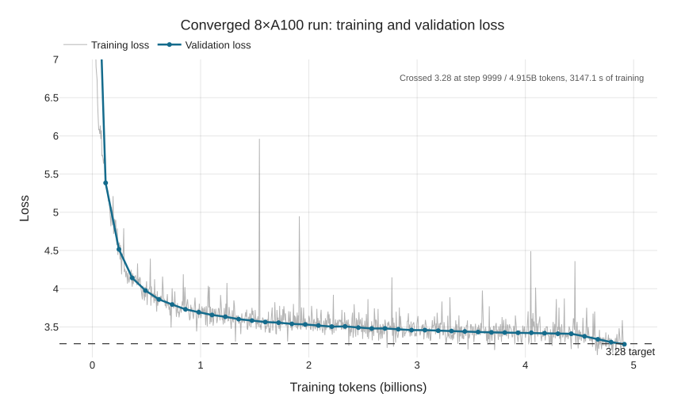

This way, my baseline ended up at ~7 h/$14 on an A100 and ~21 h/$4 on the RTX 3090 in my desktop. The latter cost is misleading, as it includes only electricity and not the capital cost (i.e., what I paid for the card), but I already had it at hand. Spending an extra $11 allows a baseline run in one-third the time, without the noise and heat in my room.

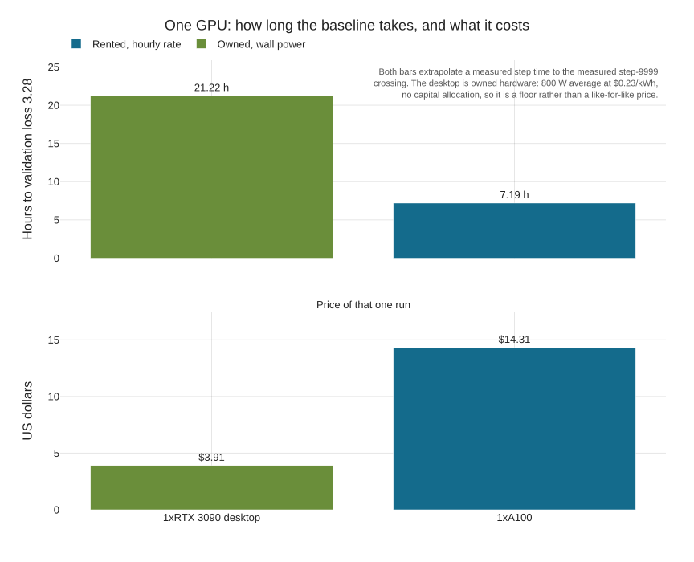

To make measurements across different world sizes consistent, the data loader must be deterministic and yield batches in a fixed order regardless of the number of ranks. Most measurements used A100 machines rather than newer H100s, as the A100s had slightly better availability and yielded a somewhat lower total cost. Experiment details are collected in [Experiment setup](#a1-experiment-setup).

# Ideal setup: DDP over high-speed interconnect

The ideal setup for training on multiple GPUs is an 8-GPU pod with a high-speed NVLink fabric between the cards. The simplest approach to using multiple cards in parallel is data parallelism: each GPU has an identical copy of the model, calculates gradients independently for a different subset of the data, then shares the gradients with all other GPUs and performs the same parameter update using the global batch gradient. As we can see from this very short description, this requires transferring roughly one model's worth of gradients between each pair of GPUs before each optimizer step, which shows why a fast interconnect is important.

Schematic of data parallelism (in a naive implementation). Image taken from the [Ultrascale Playbook](https://huggingface.co/spaces/nanotron/ultrascale-playbook?section=data_parallelism).

Using the ideal setup of 8× A100 GPUs with an NVLink fabric, the model can be trained in less than an hour, resulting in a nearly linear speedup. What's even better is that it costs almost exactly the same, which makes using DDP a no-brainer in this case.

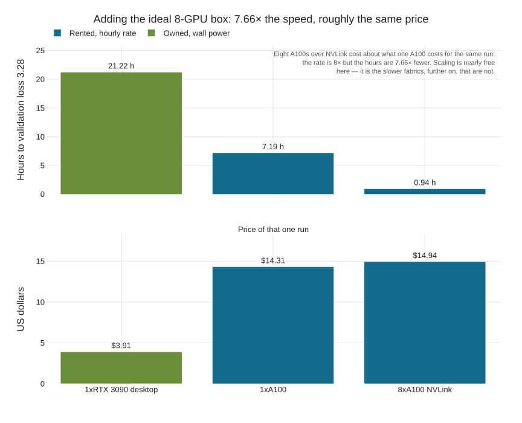

A naive implementation of DDP would introduce a long bottleneck after the local computation finishes on each rank but before the gradients are received from all other ranks. This is the biggest no-no in distributed computing, leading to low GPU utilization and inflated costs. DDP actually has a couple of tricks to reduce this gap, which are explained in detail (with measurements) in [What makes DDP go brr](#a3-what-makes-ddp-go-brr).

# DDP over slower interconnect

8× A100s over NVLink is the ideal setup... if you can get it. It turns out that despite showcasing per-GPU prices on their homepages, most providers barely have any proper 8-GPU pods available. During the few days when I was trying to run these experiments, RunPod had an 8-GPU configuration available less than 3% of the time, while PrimeIntellect, itself a marketplace collecting offers from multiple providers, had one available only at almost twice the usual price. As you can see in the screenshot below, most of the listed GPUs did not actually have an 8-GPU pod available, and even those that did had low availability.

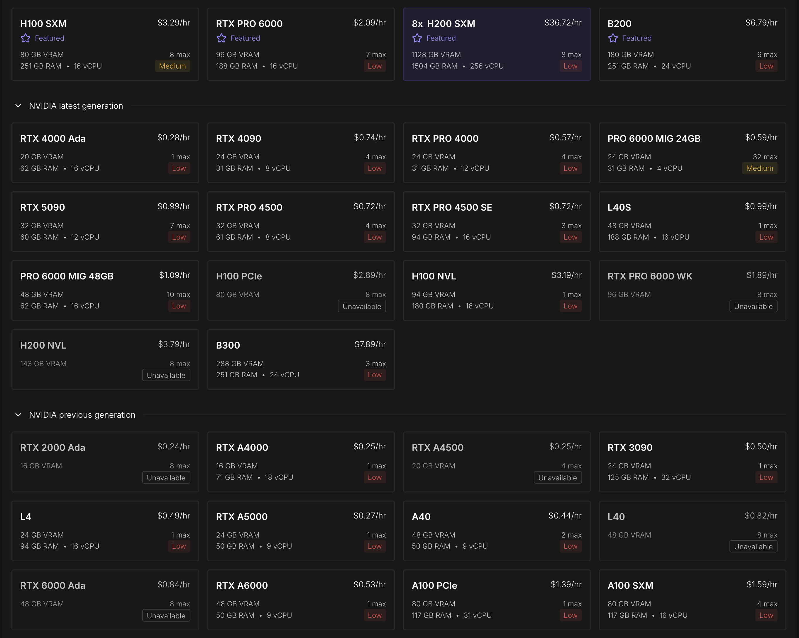

When capacity does become available, it sometimes uses the slower PCIe interconnect between cards, or the required number of GPUs may even be spread across multiple pods. Should you rent this anyway, or does slow communication destroy all the benefits of having multiple cards, leaving you to waste money? This, of course, depends heavily on the specific use case you're working with - especially the size of the model and how long processing a single batch takes on the given GPU - so these results are only indicative of this particular setup. To better understand this, I compared the same DDP workload across increasingly slow interconnects, using direct measurements where the hardware was available and reconstructions where it was not. The fastest case uses the full NVLink fabric. The PCIe point comes from a real 2-GPU A100 host where P2P was unavailable and NCCL staged through host memory; its 8-GPU result is an optimistic reconstruction. Next, I included a setup where communication was forced through the local TCP interface on an 8-GPU host, so it included the host's network stack but data did not actually leave the machine. I also added two simulated cases where the network connection speed was artificially limited to 40 Gbit/s and 10 Gbit/s, respectively, to simulate the effect of renting A100s in different boxes connected by conventional network links. Full measurement details are collected in [Experiment setup](#a1-experiment-setup).

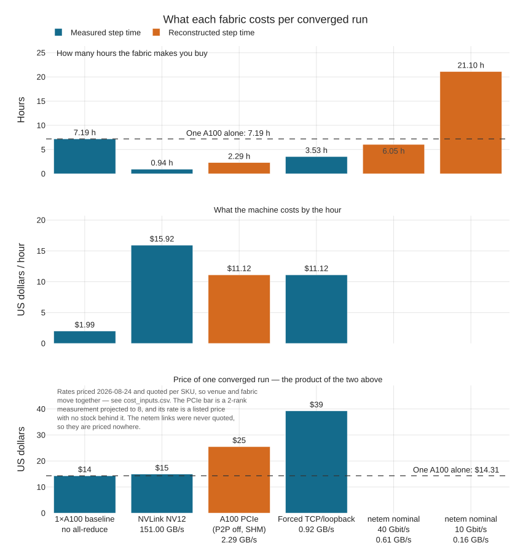

Whether renting machines with slower interconnects makes sense depends on your priorities. As we saw previously, a pod with a high-speed interconnect is a no-brainer, as it reduces runtime by a factor of almost eight for virtually no additional cost. A pod with a slower form of within-host communication still trains two to three times faster than a single GPU, but also costs two to three times as much. Essentially, you're paying a high premium for a somewhat faster run. However, if your bandwidth is limited to even 40 Gbit/s - which is nothing to sniff at in terms of network bandwidth - then distributed data-parallel training across multiple GPUs hardly makes sense: the run is only slightly faster than on a single A100 and costs several times more. At 10 Gbit/s, it becomes both slower and much more expensive than the single-GPU run.

What happens in these cases is that the GPUs spend most of their time waiting for communication to happen, so you're paying mostly for wasted hours.

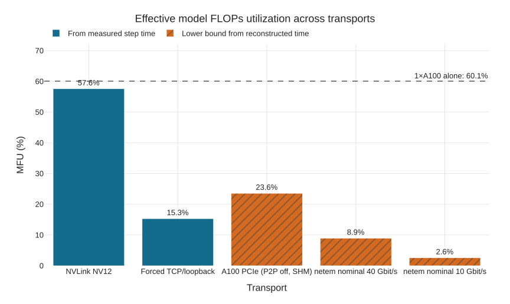

Plotting the total time to convergence shows that it is almost completely linear in the inverse of the available communication bandwidth. This is hardly surprising, given that the compute time for a batch size of 64 is around 43 ms, while the communication overhead goes from ~7 ms on NVLink to over 1,000 ms over TCP.

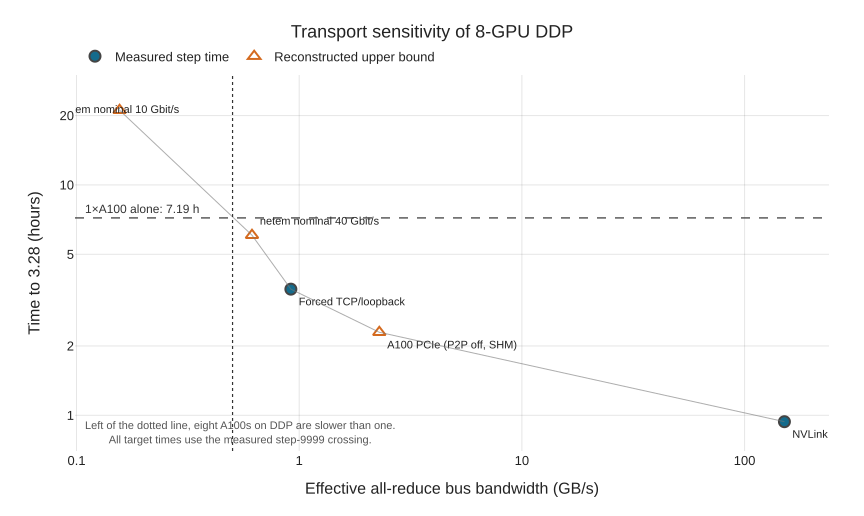

# Reducing communication with DiLoCo

The reduction in available communication bandwidth led to clear underutilization of the GPUs. We can't create well-connected GPU pods out of nowhere, so can we change the distributed algorithm to reduce its dependence on frequent high-bandwidth communication? When using DDP, the most important knob we have is increasing the batch size, but that quickly becomes undesirable. As we keep increasing the batch size, more and more samples are processed before the model is updated. This means we already have a lot of information telling us what to change in the model (the gradient accumulated so far), yet we keep processing more minibatches with the original model just to be extra certain. It is easy to see how this becomes a waste of computation above a certain batch size. (Of course, DDP also has other parameters we could tune, such as bucket size, the degree of overlap, or gradient compression, to name a few.)

An alternative approach is to let the ranks update their models individually without communicating with the other ranks, and synchronize only occasionally. There are many ways of achieving this; the question is how well we can combine these individual changes - do they compound or diverge? Distributed Low-Communication (DiLoCo) is one method that has been shown to work reasonably well. Under DiLoCo, each rank uses an inner optimizer for multiple local steps, which matches the optimizer we've been using before. The resulting model differences (or pseudo-gradients) are then averaged, and an outer optimizer uses them to calculate a global model update that is shared with every rank. A very nice additional advantage of DiLoCo is that it makes it much easier to use a heterogeneous set of GPUs, which may require different microbatch sizes and finish computation at different times. The original paper suggests that this can reduce communication by a factor of 500, which is certainly a very appealing prospect. Can we use this to overcome our GPU poorness?

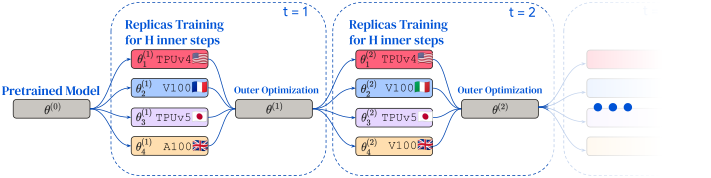

DiLoCo architecture. Image from the [DiLoCo paper](https://arxiv.org/abs/2311.08105).

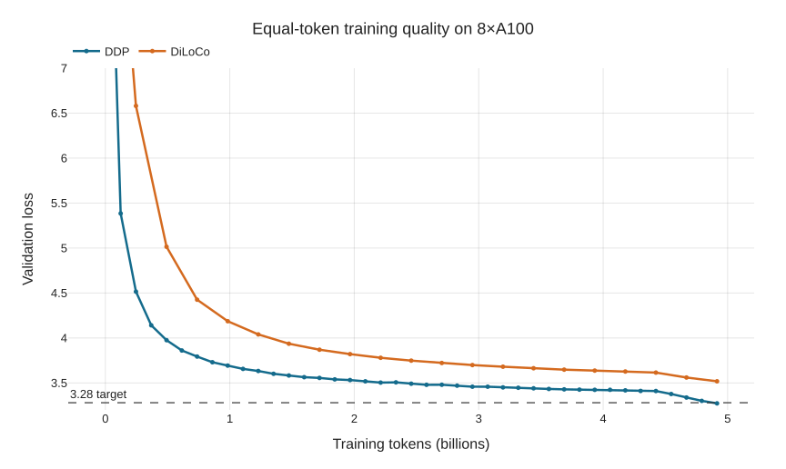

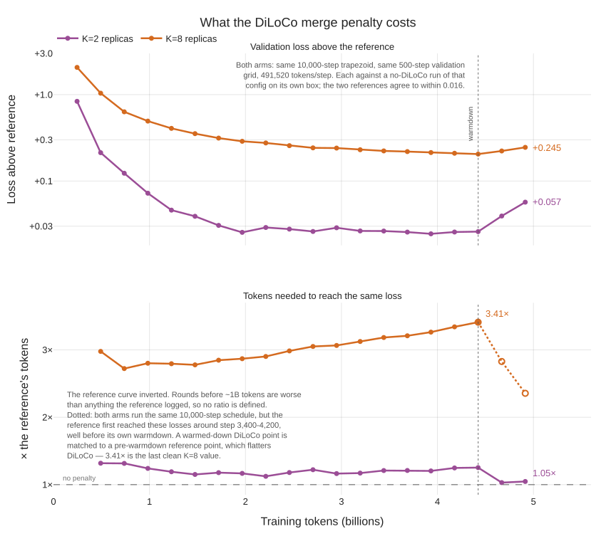

As we can see, under the same 10k-step training regime, DiLoCo worsened the final validation loss by 0.245 (3.525 instead of 3.28). In this untuned run, DiLoCo had not reached the target loss after the original 10k-step budget. Extrapolating the observed curve suggests that it would take roughly three times as many steps to track the original validation-loss curve, but that estimate needs to be verified by a measured target-loss run. Luckily, DiLoCo barely adds any overhead compared with DDP in terms of training time or total cost for the same step count, albeit with worse results. (All numbers in the text refer to the K=8 case. The difference is much smaller when using only two workers.)

We must not forget, however, that DiLoCo introduced three new parameters to tune: the synchronization interval H, the outer learning rate, and outer momentum. I originally planned to use the hyperparameters reported in the paper, but those quickly turned out to be unsuitable for this model. To tune this properly, we would now need to spend additional money finding reasonable values for these parameters on top of all the other parameters in the training setup, adding both cost and uncertainty. The hyperparameters used in my study are simple guesses, so I expect that one could reduce the difference with a bit of hyperparameter tuning.

While I did not run enough experiments to find the actual crossover point for DiLoCo, assuming that the extrapolated 3× step count holds, we can still estimate how much it would cost to train our model to the desired level with suboptimal network connections. (The weird-looking drop in the last plot that tracks the ratio between the tokens needed by the baseline and the DiLoCo runs is caused by the interactions of the learning rate scheduler warmdown period and DiLoCo's momentum, which is explained in more detail in [What would make DiLoCo go brr](#a4-what-would-make-diloco-go-brr).) These estimates suggest that DiLoCo has the great advantage of being virtually unaffected by the reduction in communication speed and remaining usable over slow network links with high measured utilization.

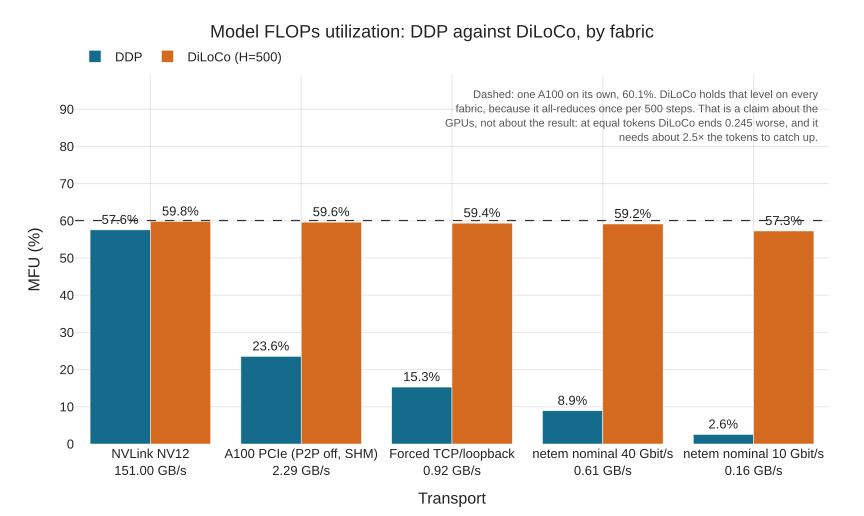

If you are forced to accept suboptimal pods, or GPUs spread across multiple pods with conventional network connections between them, DiLoCo appears to move the economic crossover far enough that poorly connected GPUs may become viable. Establishing the true cost, however, requires tuning and a measured run to the target loss.

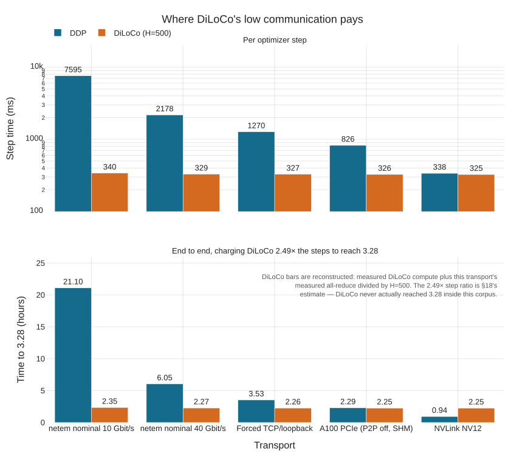

# Conclusion

I set out both to answer a practical question about scarce GPU capacity and to gain a better understanding of what distributed training actually does underneath the abstractions. Reimplementing the core data-parallel operations exposed several details I had previously known only in theory: the ordering of collectives, gradient bucketing and overlap, the interaction with the compiler, and how quickly communication costs turn into idle GPU time. If you are interested in exploring the implementation, [ddp_synchronizer](../src/distrain/ddp_synchronizer.py) is a good place to start. I then trained the same model on the same data across one, two, and eight GPUs, using pods from different providers and two distributed optimization algorithms. This connected those implementation details to their practical and economic consequences.

For this workload, eight NVLink-connected A100s gave nearly eightfold speedup at approximately the same total cost. Slower within-host interconnects still reduced wall-clock time, but at a substantial cost premium. At a nominal 40 Gbit/s, DDP was only slightly faster and several times more expensive than a single A100; at 10 Gbit/s, it became slower as well. DiLoCo largely removed the network bottleneck, but introduced an optimization penalty: the untuned eight-worker run did not reach the target loss within the original budget, and its apparent requirement for roughly three times as many steps remains an extrapolation rather than a measured result.

The practical lesson is that GPU count and hourly price are insufficient when evaluating scarce capacity: topology can determine whether additional GPUs are an acceleration or merely additional cost. DiLoCo may make poorly connected hardware viable, especially after the ordinary training recipe has already been tuned, but these experiments do not yet establish its true crossover point. More broadly, implementing and measuring these methods showed me that even the supposedly simplest form of distributed training contains a surprising amount of machinery, and that its rules of thumb only become useful when tied to the actual ratio of computation to communication.

When renting distributed hardware, you are not just renting GPUs—you are renting the links between them.

# What's missing

- Each run was performed only once, so no spread or uncertainty is shown in any of the plots or numbers.
- While I deliberately excluded the Muon optimizer from the model, there are still some AdamW optimizations tested in the modded-nanoGPT repo that I haven't adopted, leaving another 50% of performance on the table. While this wouldn't have changed the relative distributed results, it would have made the experiments faster and cheaper, or allowed me to try more hyperparameters.
- I did not perform a hyperparameter search for DiLoCo, so the related conclusions are weaker than they could be.

# Appendix

## A1. Experiment setup

All headline runs use the same model, data and training recipe. The short DDP implementation benchmarks vary the microbatch or transport, but they do not feed back into the convergence result.

| Item | Setting |
|---|---|
| Model | 12 transformer blocks, 12 attention heads, width 768, sequence length 1024, vocabulary 50,304, no bias or dropout. The untied embedding and output head bring the total to 162,220,800 parameters. |
| Data | GPT-2 BPE tokens from the first 55 training shards of FineWeb10B (5.5B tokens), plus its validation shard. A 10,000-step run stays within those shards and does not wrap around the corpus. |
| Inner optimizer | Fused AdamW in CUDA runs, learning rate 1.8e-3, betas (0.9, 0.95), weight decay 0.1 and gradient clipping at 1.0. The trapezoidal schedule has 250 warmup steps, a constant plateau and 1,000 warmdown steps. |
| Precision and compiler | BF16 autocast, TF32 enabled, and `torch.compile` unless a plot explicitly compares compiled and eager execution. The environment is pinned to Python 3.12, PyTorch 2.13 and the CUDA 12.6 PyTorch build. |
| Validation | Mean cross-entropy over the first 10,485,760 tokens of the FineWeb validation split, always in the same order and in batches of 32 sequences. Validation runs on rank 0 and the scalar is broadcast. The headline is the first unsmoothed validation loss at or below 3.28. |
| DiLoCo | K=8 replicas, H=500 local steps between synchronizations, outer learning rate 0.7 and Nesterov momentum 0.5. The inner optimizer and learning-rate schedule are the same AdamW recipe as above. These outer parameters were not found by a systematic search. |

Unless a plot says otherwise, the global batch is fixed at 480 sequences, or 491,520 tokens per optimizer step. Changing the world size changes only how that batch is partitioned: step *t* always reads the same 480 sequences in the same order. In the matched-microbatch scaling measurements, each GPU processes 30 sequences per forward/backward pass and gradient accumulation is adjusted to 16, 8 and 2 iterations at world sizes 1, 2 and 8, respectively. The full 8-GPU DDP and DiLoCo runs use 60 sequences per GPU and no gradient accumulation. The ratio sweep in Appendix A3 is the deliberate exception: it uses microbatches of 8, 16, 30 and 60 with no accumulation, since the point of that experiment is to vary the amount of computation available to hide communication.

“Step” means one inner optimizer update. For DDP, that is one AdamW update after gradient accumulation and averaging across every rank. For DiLoCo, every replica makes one local AdamW update, and an outer step combines the model differences at each H=500 boundary. Because the log is zero-indexed and no merge happens at step 0, the first DiLoCo round contains 501 updates, full intervening rounds contain 500, and the final partial round merges at the last step. Both methods still process the same global 491,520 tokens per step, and the 10,000-step comparison covers 4.9152B tokens. Log step 9999 is the final update of this zero-indexed schedule. The DDP and RTX 3090 convergence runs actually reached the target; several other time-to-target bars combine a measured steady-state step time with that independently measured crossing step rather than rerunning the full optimization on every transport.

The A100 measurements use more than one SKU. The full DDP and DiLoCo runs used 8× A100-SXM4-80GB; the matched scaling measurements used A100-SXM4-40GB cards, whose measured BF16 roofline was effectively identical. Cost plots use a 2026-08-24 on-demand list-price snapshot: $1.99/h for one 40GB SXM4 A100, $15.92/h for the corresponding 8-GPU NVLink pod, and $17.56/h—the mean of $12.72 and $22.40 quotes—for an 8×80GB SXM4 pod. The unavailable 8×80GB PCIe listing was $11.12/h. The transport-cost plot charges that cheaper $11.12/h rate to every non-NVLink option, giving the slow configurations the benefit of the cheapest advertised hardware. The desktop RTX 3090 cost assumes 800 W at the wall and $0.23/kWh, with no capital cost.

The transport axis mixes direct measurements and reconstructions, so the distinction is important:

| Transport label | Evidence |
|---|---|
| NVLink | Measured on real 8-GPU SXM4 hosts with a full NV12 topology. |
| A100 PCIe | Measured on a real 2× A100-PCIe-80GB host. GPU-to-GPU P2P was unavailable, so NCCL staged through host memory. The plotted 8-GPU step time is an optimistic reconstruction from that measured bandwidth; I never managed to rent the actual 8-GPU configuration. |
| Forced TCP/loopback | Measured on an 8-GPU NVLink host after disabling NCCL's P2P and shared-memory transports. Traffic traversed the host network stack but never left the machine. |
| Nominal 40 and 10 Gbit/s | Applied locally with `netem` to the TCP case. Communication was measured under the limits, while the batch-480 step times were reconstructed as compute plus communication and should be treated as upper bounds. These are simulations of limited bandwidth, not measurements of a real multi-node cluster. |

## A2. How fast are those GPUs, really?

To calculate Model FLOPs Utilization (MFU), one of the most widely used metrics when measuring distributed training, we first need to know the actual maximum FLOP/s of the given GPU. The obvious move is to look it up in the datasheet, but that gave me a bit of a headache. A vendor spec sheet quotes several different numbers for what looks like the same thing: tensor-core versus CUDA-core rates, dense versus 2:4-sparse figures (a factor of two), and, for FP16/BF16, separate rates depending on whether accumulation happens in FP16 or FP32 (another factor of two on consumer cards). My first attempt used 35.6 TFLOP/s for the RTX 3090, which is that card's FP32 *non-tensor* rate, and the training loop then cheerfully reported an MFU of 158%. The only reason I caught it is that anything above 100% is impossible.

So I stopped citing and started measuring: `scripts/measure_roofline.py` runs large square BF16 GEMMs at a few sizes and reports the best sustained throughput. This is a lower bound on the true peak rather than the peak itself, but it represents what the hardware demonstrably does, making it a useful practical denominator for utilization. Strictly speaking, this is measured-roofline utilization rather than conventional MFU, which uses the theoretical peak. Every MFU number in this post uses this nonstandard measured denominator for the exact card, and the difference from the datasheet is not small:

| Card | Measured BF16 (TFLOP/s) | Datasheet dense (TFLOP/s) | Measured / datasheet |
|---|---|---|---|
| A100-SXM4-80GB | 269.9 | 312.0 | 86.5% |
| A100-SXM4-40GB | 270.1 | 312.0 | 86.6% |
| A100 80GB PCIe | 256.5 | 312.0 | 82.2% (71.8% at 16384³) |
| RTX 3090 | 82.6 | 71.2 | 116% |

The two A100 SXM4 cards land at ~86.5% of their quoted 312 TFLOP/s, which is roughly what you would expect from a real GEMM measured against a marketing number. The PCIe A100 is the interesting one: NVIDIA quotes the same 312 TFLOP/s for it as for the SXM4 part, even though it is a 300 W card rather than a 400 W one, and its sustained performance does not hold up. It peaks at 256.5 TFLOP/s on a 4096³ GEMM and then *falls* to 223.9 TFLOP/s on a 16384³ one, i.e., it throttles on exactly the long, large matrix multiplications representative of training, while the SXM4 cards hold their rate. The 3090 goes the other way, and at first glance, the result looks impossible. The [GA102 whitepaper](https://www.nvidia.com/content/PDF/nvidia-ampere-ga-102-gpu-architecture-whitepaper-v2.1.pdf) gives 71.2 TFLOP/s for dense BF16 tensor operations with FP32 accumulation—the only BF16 mode the hardware has, since BF16 always accumulates in FP32—while the 142.3 printed beside it is the corresponding rate with 2:4 sparsity. My card, however, sustains 82.6 TFLOP/s, 16% *above* the published rate. The resolution is the clock. Peak rates in that table are quoted at the 3090 Founders Edition's 1695 MHz boost clock, and my card is not a Founders Edition: it has a 420 W power limit, and when sampled during a 16384³ BF16 GEMM, it held a mean SM clock of 1990 MHz at 394 W, power-capped rather than thermally throttled. Per clock, that is 41.7 kFLOP/clock against the 42.0 kFLOP/clock implied by the whitepaper figure—99.3% of the architectural rate. The card is doing exactly what NVIDIA says a GA102 does, just at a 17% higher clock than the table assumes; a rented 3090 that measured 75.3 TFLOP/s achieved the same per-clock rate at about 1.79 GHz. A peak quoted at a reference boost clock is no more a property of the card in your machine than a peak quoted for a 400 W part describes the 300 W one you rented.

All this is really just to say that even the seemingly trivial question of "how fast can the card I'm comparing against actually go?" has more nuance than one might expect, making it easy to draw incorrect conclusions from measurements across different providers, pods, and GPUs.

## A3. What makes DDP go brr

Data parallelism works by dividing the batch into K distinct parts. Each rank (GPU) processes one part, then uses the `all_reduce` communication primitive to average the partial gradients across all ranks. Each rank uses this global gradient to perform an identical update to its copy of the model parameters. To better understand the trade-offs and gain a bit more familiarity, I implemented these variants by hand using only basic communication primitives such as `all_reduce` and `broadcast`. Describing each algorithm in full is well outside the scope of this post, but you can find fantastic explanations in resources such as the [Ultrascale Playbook](https://huggingface.co/spaces/nanotron/ultrascale-playbook).

Schematic of data parallelism (in a naive implementation). Image taken from the [Ultrascale Playbook](https://huggingface.co/spaces/nanotron/ultrascale-playbook?section=data_parallelism).

A naive implementation first waits for all gradient calculations to finish, then initiates an `all_reduce` separately for each tensor. There are a few problems with this. First, initiating communication has some overhead of its own, so doing it one tensor at a time is inefficient for small tensors. A slightly improved version is `ddp_bucketed`, which combines tensors into buckets of predefined sizes, reducing the number of `all_reduce` operations and saving some of that overhead. This in itself isn't a huge win, though, and we can do better. Gradients become available one by one during the backward pass and don't depend on each other once they have been calculated, so we can share them immediately. This way, we can overlap a gradient's communication with the computation of gradients for preceding layers and avoid the dreaded gaps in GPU utilization caused by blocking communication.

Schematic of interleaved and bucketed data parallelism. Image taken from the [Ultrascale Playbook](https://huggingface.co/spaces/nanotron/ultrascale-playbook?section=data_parallelism).

There are a few low-level details we need to pay attention to, though. First, as with all these communication primitives, we need to ensure that all ranks invoke collectives in the same order with matching tensor shapes. The low-level primitives simply push tensor values through the channel, without any additional metadata or checks to verify that they correspond to the intended parameters. While this trivially holds for our small and simple model, we could theoretically end up in a situation where a rank produces no gradient for a given tensor in a batch, e.g., when using a Mixture-of-Experts model. We also need to ensure that the buckets we create follow the order in which the gradients become available, so we can't just blindly follow the order in which the model components are defined. Things like tying the embedding and LM head—the first and last tensors in the graph—can easily trick us. However, the largest effect actually comes from the compiler. One of the most important optimizations the compiler performs is fusing consecutive operations so that they run as a single large kernel on the GPU, without interruption or host synchronization. This makes computation faster, but AOTAutograd can turn the whole backward pass into a single autograd node, causing our post-accumulate hooks to fire only after all the gradients have been computed.

PyTorch's default [`DDPOptimizer`](https://docs.pytorch.org/docs/stable/notes/ddp.html#torchdynamo-ddpoptimizer) solves exactly this problem when the model is wrapped in `DistributedDataParallel` *before* it is passed to `torch.compile`, as it is in this project. Dynamo walks the captured forward graph in reverse, counts parameter bytes in approximately the order their gradients will become ready, and splits the graph at DDP's bucket-size boundaries. AOTAutograd and Inductor then compile each piece separately. During the backward pass, control returns to the autograd engine between pieces, allowing DDP's reduction hooks to launch an all-reduce while the next piece of backward computation is still running. With our 25 MiB bucket cap, this produces 14 compiled subgraphs. The trade-off is exactly the one described above: PyTorch preserves communication overlap, but gives up fusion opportunities across 13 graph boundaries.

My hand-rolled modes are just ordinary models as far as the compiler is concerned, so they do not get this DDP-aware partitioning. Under `torch.compile`, their backward pass is fused into one piece and all their hooks become ready at the end; compiled `ddp_interleaved` therefore does not actually interleave communication with computation and behaves much like the bucketed version with asynchronous launches. This is why the compiled PyTorch DDP baseline and the compiled hand-rolled implementation are making opposite trades rather than simply being better or worse implementations.

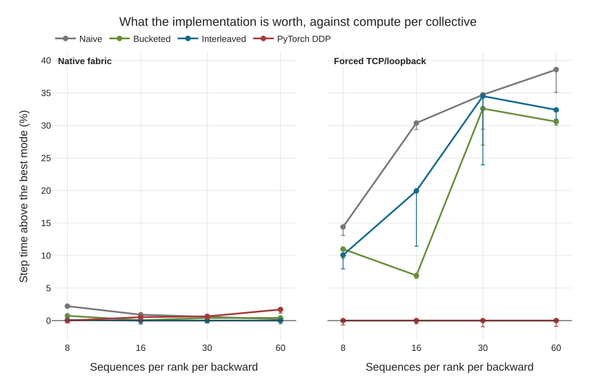

Above is a plot of how much slower each version of DDP is than the fastest one. On the left, we can see that with NVLink, the difference is negligible: virtually all methods perform identically. On the slower interconnect shown on the right, the differences become more pronounced. However, we can also see that the method only makes a difference if there is enough computation with which communication can overlap. As the microbatch size increases (moving right on the x-axis), so does the time it takes to process the batch. At a microbatch size of 8, the computation takes only 49.5 ms, while a 649 MB all-reduce takes over a second. The collective occupies 96% of the step, and every mode issues the same one, so the entire implementation question lives in the remaining 4%. Naive is the exception because it changes the communication itself—75 small collectives instead of 14 fused ones, costing ~400 ms—while the other three sit within roughly one batch's compute time of each other, and their ranking is decided by host jitter. This leads to the conclusion that, for throughput, it is best to maximize the microbatch size up to the memory limit, but that is something you'd be doing anyway. The more general lesson is the same one we saw previously: what matters is the ratio of compute to communication, and every "X is faster than Y" claim about distributed training is really a claim about where you sit on that axis.

## A4. What would make DiLoCo go brr

DiLoCo is completely untuned in the current tests. However, the end of training looks particularly suspicious and is worth a bit of extra discussion. The training uses a trapezoidal learning-rate schedule, following one of the entries in modded-nanoGPT, so there is a warmdown period at the end. This schedule is applied only to the inner optimizer, not the outer optimizer used by DiLoCo. The outer optimizer uses Nesterov momentum, so it keeps making fairly large steps influenced by previous update directions even as the incoming pseudo-gradients get smaller. Most likely, decaying the momentum to zero would significantly reduce the overshoot and help the DiLoCo version stay close to the baseline's validation loss without the weird divergence in the last 1k steps.
